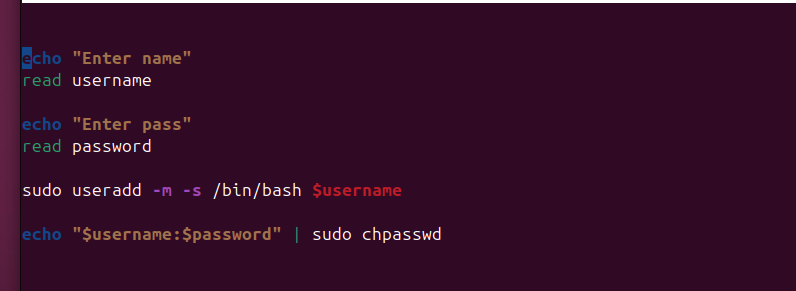
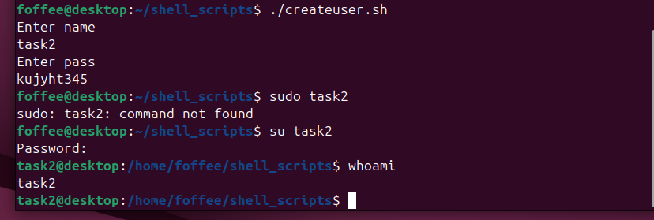
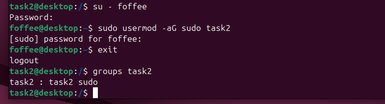
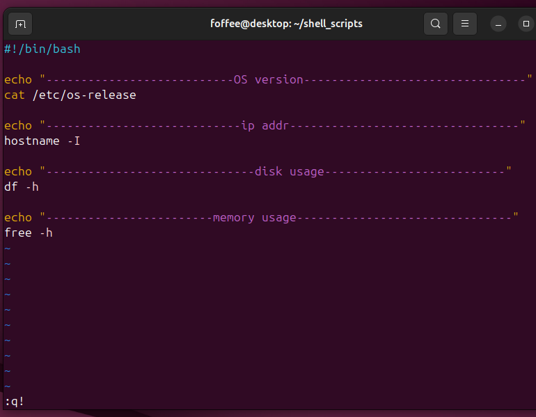
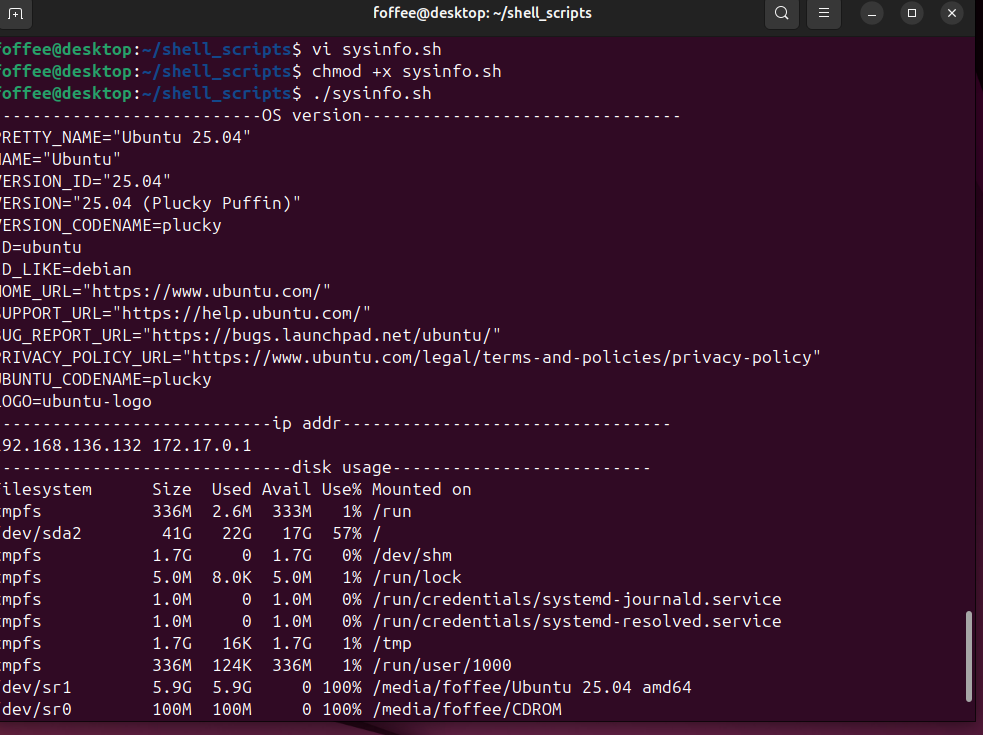

# Task 1 - Basic Linux setup

## Description
This task involves creting a user, installing few packages and sharing the system info.

## Steps

### Step 1 - Writing basic script to Create user with pass 
Create user using "#sudo adduser user1" or write a script asking the name and password for user.

### Step 2 - Executing script
Give permission to execute #chmod +x filename.sh

### Step 3 - Giving root access to user using sudo

### Step 4 - Installing packages
Installed all the packages using #sudo install.....

### Step 5 - Writing a script to collect system information

### Step 6 - Executing the file after giving access

