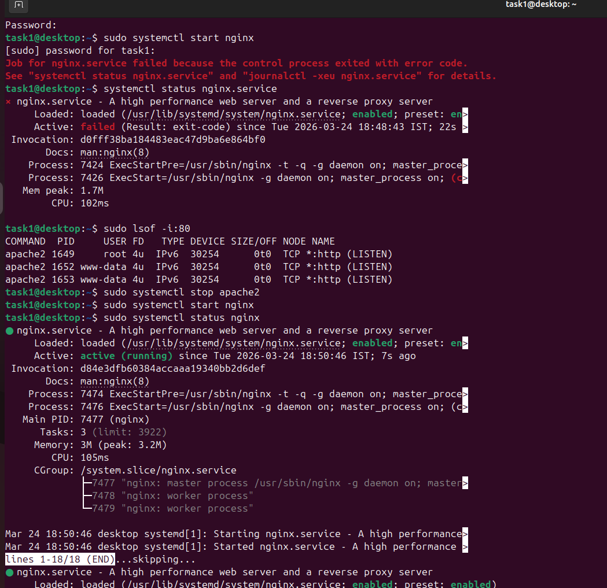

# Task 1 - Service Management

## Description
This task involves starting a service.

## Steps

### Step 1 - Checking status of nginx
#sudo systemctl status nginx

### Step 2 - If failed check which service is using nginx port
#sudo lsof -i :80

### Step 3 - Stop the service and start nginx

