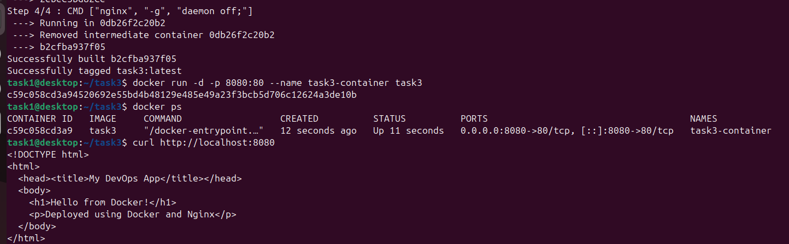
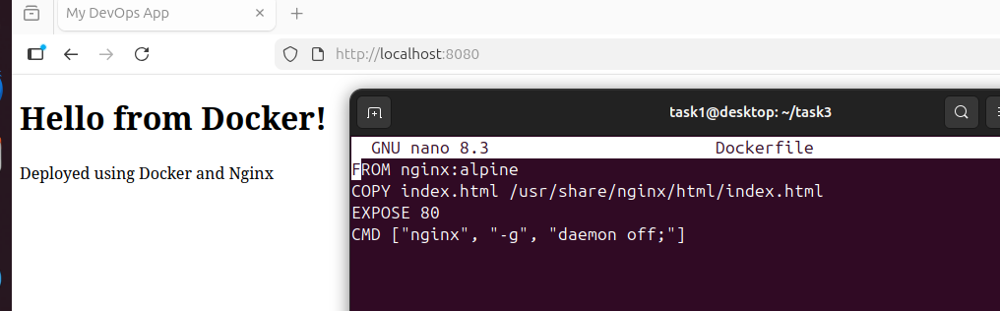

# Task 3 - Docker 

## Description
This task involves building our html app using docker.

## Steps

### Step 1 - Setup index.html and Dockerfile

### Step 2 - Build the image form dockerfile

### Step 3 - Start the container using image
List all the running container using #docker ps

### Step 4 - Accessing the app

